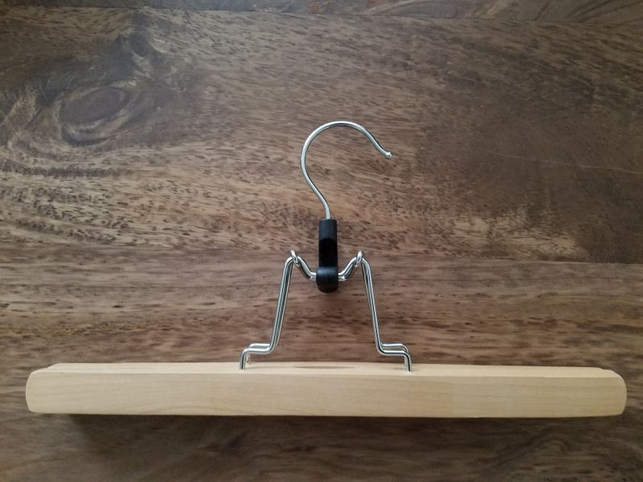

# PantHangerFix
3d printed part for pant hanger
I usually buy these wooden hangers:

The problem is that the plastic part breaks if you put something too thick on it.  I usually do that...

So I printed a replacement:
![newHook] (newHook.jpg "New Part")

![hookPart] (hookPart.jpg "smaller inner hook")

I first tried making just the plastic part, and then inserting the metal hook into it.  This turned out ok, but it is a ton of work.  So I just printed a plastic hook to go with it.  
I gave it a big space where the two parts meet so that it can rotate

The parts are split so you can print them flat and then glue together (You have to assemble the small hook part first and then glue the large hook with the smaller part inside)

